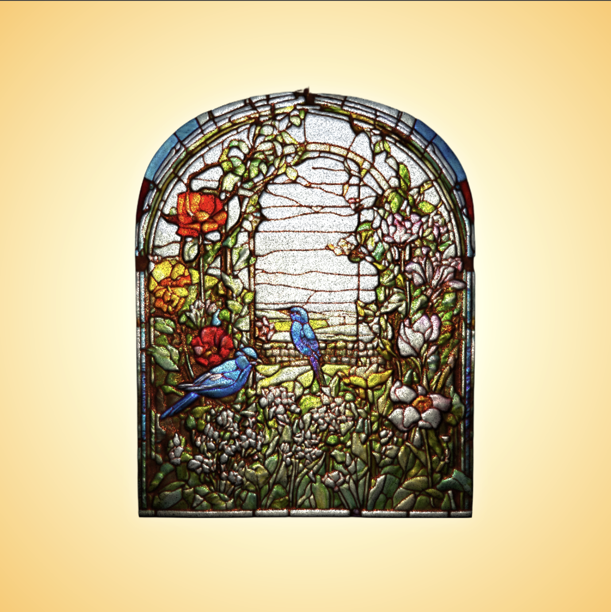

## 3D Stained Glass

A 3D rendering of a 2D stained glass design through determining normal and height maps. Here I used DeepBump, a Blender add-in to generate these maps.

Subject is of a garden with flowers and birds, which I chose for variety in colour and texture. 
