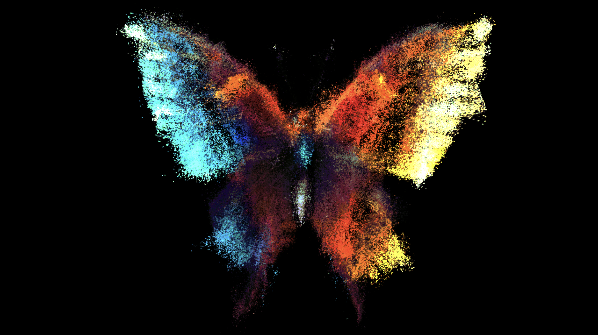

# Touchdesigner Projects

A personal repository for TouchDesigner projects.

## 1. LNM_particlesGpu

A visualisation through animated particles of an image generated by Refik Anadol’s open source Large Nature Model.

Said generated picture is of a butterfly, with ripple effects added to bring to mind the butterfly effect.

## OSC_Unreal

An environment rendered using Unreal Engine having lighting properties vary with OSC-based signals from a TouchDesigner project.

The environment is inside a subway, currently lights are both randomised as well as pulsing in intensity.

## LavaRand 

A project inspired by Cloudflare's use of lava lamps to create secure encryption keys. 

Uses continuously updating typography as well as interactive elements based on colours/shapes in a lava lamp.
